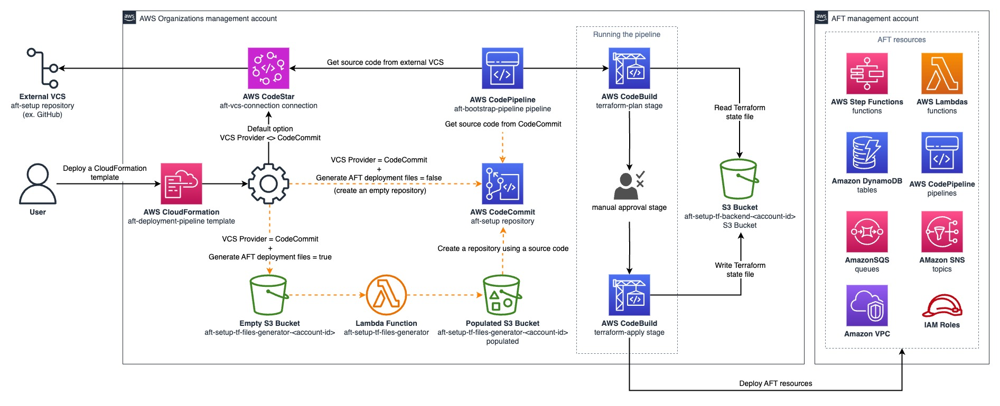

# Account Factory for Terraform (AFT) bootstrap pipeline

This repository introduces a streamlined and secure method for deploying Account Factory for Terraform (AFT) within the management account of AWS Organizations. Our approach centers around a CloudFormation template that simplifies and automates the AFT setup process. The template creates a Terraform pipeline, designed for ease of adaptability and maintenance.

Prioritizing security and data integrity, the Terraform state file is securely stored in an S3 bucket, featuring server-side encryption and policies to block public access. This ensures the safeguarding of the state file against unauthorized access and data breaches.

In recognition of the management account's critical role in AWS Control Tower, this solution adheres to AWS best practices. It aims to provide an efficient, secure, and compliant process for AFT deployment.

The following resources can be deployed by this solution:

- CodeBuild
- CodeCommit
- CodeConnection
- CodePipeline
- EventBridge
- IAM
- Lambda
- S3

## Table of Contents

- [Diagram](#diagram)
- [Prerequisites](#prerequisites)
- [Limitations](#limitations)
- [Versions](#versions)
- [Security](#security)
- [License](#license)

### Diagram

---

## Prerequisites

- AWS Accounts: A basic AWS multi-account environment with at least an AWS Management account, AWS Log Archive account, AWS Audit account and one additional account for AFT management.
- AWS Control Tower Setup: An established AWS Control Tower environment is essential. The management account should be properly configured as this template will be deployed within it.
- AWS Account Requirements: Ensure you have the necessary permissions in the AWS management account. You'll need sufficient privileges to create and manage resources like S3 buckets, Lambda functions, IAM roles, and CodePipeline projects.
- Terraform Knowledge: Familiarity with Terraform is crucial. Understanding Terraform's core concepts and workflow is important as the deployment involves generating and managing Terraform configurations.

## Limitations 

- Resource Limitations: Be aware of the AWS resource limits in your account. The deployment may create multiple resources, and hitting service limits could impede the process.
- Version Compatibility: The template is designed for specific versions of Terraform and AWS services. Upgrading or changing versions may require template modifications.
- Self-managed VCSs: This template doesn't support self-managed VCS services, such as GitHub Enterprise.

## Versions

- Terraform: >=1.6.6
- AFT: >=1.11

## Security

See [CONTRIBUTING](CONTRIBUTING.md#security-issue-notifications) for more information.

## License

This library is licensed under the MIT-0 License. See the LICENSE file.

